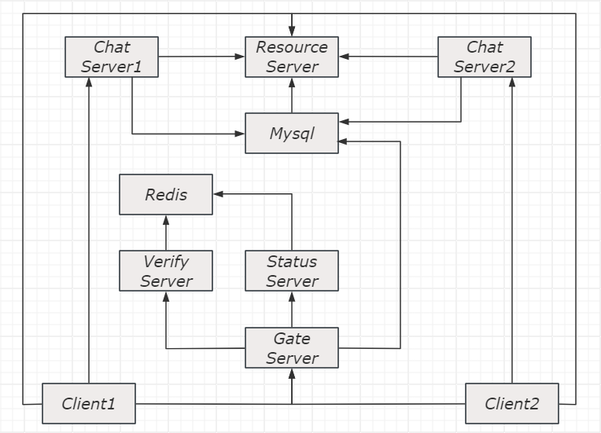

### 简介：

本项目为C++全栈即时通讯项目，支持多线程、高并发、分布式部署。

##### 技术栈：

`Qt`界面设计、`boost::asio`异步网络编程、`boost::beast`搭建`http`网关、`gRPC`分布式通信、`MySQL`和`Redis`应用、`Node.js`搭建验证服务。

`C++`11及以上现代技术、智能指针、线程池、模板编程、伪闭包、`RAII`。

### 项目描述：

##### 服务器：

- 多线程封装`asio` `io_context`池提升并发性能。
- `GateServer`网关对外使用`http`服务。
- 各个服务器之间通信依靠`grpc`，支持断线重连。
- 聊天和文件服务器使用`asio`库实现异步的`tcp`可靠长连接（心跳保活）。
- 使用`Node.js`搭建邮箱验证码服务器`VerifyServer`。
- 基于`MySQL-Connector 8`库封装连接池。
- 服务器间共享数据缓存采用`Redis`。
- 前后端通讯采用`ProtoBuf` `Json`格式。

##### 客户端：

- 基于`QListWidget`实现聊天和联系人列表。
- 基于`Qt network`模块采用单例模式封装`http`和`tcp`服务。
- 基于`QWidget`利用`QPainter`封装聊天窗口。
- 基于`QFrame`封装聊天气泡。
- 利用`Qt`信号槽机制充当线程安全的队列。
- 模仿微信客户端的样式使用`qss`美化界面。

### 架构设计：

***

##### 运行情况：

##### 登录页面：

##### 注册页面：

##### 修改密码页面：

##### 好友搜索：

