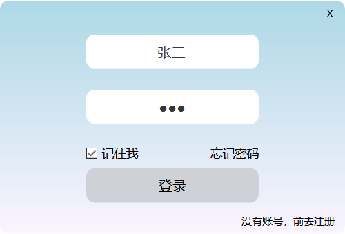

这是一个基于C++、QT和MYSQL的消息服务器中转即时通讯软件。

### 服务端

- 采用了线程池，支持高并发，多客户端同时连接，理论最大客户端连接量为50×处理器最大线程数。
- 选用消息队列进行组件解耦、流量削峰、异步处理、保证可靠性和顺序性。
- 消息模块设计采用工厂模式，保持了良好的封装性，降低了耦合度，提供了标准的接口。使用Json数据类型序列化和反序列化消息对象。
- 由于本项目消息队列的生产和消费速度基本一致，本项目消息队列的多线程同步机制采用互斥锁。
- 用户列表设计采用单例模式，保持了良好的实例控制，使得对象具有唯一性，节省资源，使用灵活。
- 针对项目的需求二次封装了QTcpServer和QTcpSocket，提供了专属消息模块收发接口。
- 使用线程池进行消息处理，避免线程频繁创建和销毁造成的资源浪费。
- 支持离线消息，离线消息存储在MYSQL中，当用户上线就会取出发送并删除。

### 客户端

- 客户端实现使用多线程，即使收到大量消息，主界面也不会卡顿，支持文本消息，图片消息，文件消息，聊天记录存储采用XML。
- 充分利用QT开发GUI的特性，界面精美，方便易用，支持Linux跨平台使用，在Ubuntu下兼容性良好。

### 图片展示

##### 登录窗口：

##### 项目展示

##### 主窗口展示：

