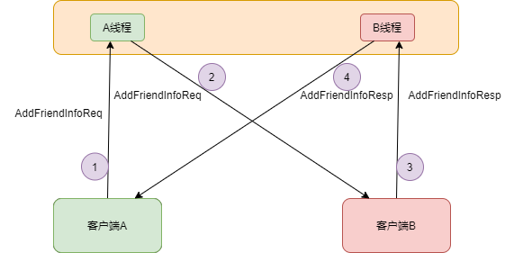

# 用户登录和验证：

- 用户输入用户名和密码登录即时通讯服务器。
- 服务器从用户数据库中验证用户身份，确保用户名和密码正确。
- 如果验证成功，服务器记录用户的 IP 地址以及使用的 TCP/UDP 端口号。
- 服务器返回登录成功标志，此时用户 A 在 IM 系统中的状态为在线

# 好友列表和在线状态：

- 根据用户 A 存储在 IM 服务器上的好友列表（Buddy List），服务器将用户 A 在线的相关信息发送给其他在线的即时通讯好友的 PC 机。
- 这些信息包括在线状态，用户名，id,头像。
- 好友的即时通讯软件收到这些信息后，会在 PC 桌面上弹出一个小窗口来提示用户 A 的在线状态

# 数据库：

##### 用户表：

包含用户的id、用户名、头像、密码等信息

##### 好友关系：

用于存储用户之间的好友关系。这个表通常包含两个用户的id和好友状态（例如“已接受”、“待接受”等）。

```sql
CREATE TABLE friendship (
    friend_of INT NOT NULL,
    friend_to INT NOT NULL,
    status ENUM('已接受', '待接受', '拒绝','删除') NOT NULL DEFAULT '待接受',
    PRIMARY KEY (friend_of, friend_to),
    UNIQUE KEY friend_to (friend_to, friend_of)
);
```


##### 处理好友：



1. **状态字段**：
   - 首先，我们可以在表中添加一个状态字段，用于表示好友关系的状态。
   - 这个字段可以是一个枚举值或字符串，表示不同的状态，例如：“已接受”、“待接受”、“拒绝”等。
2. **状态转换**：
   - 当用户发起好友请求时，我们可以将状态设置为“待接受”。
   - 如果另一个用户接受了好友请求，我们将状态更新为“已接受”。
   - 如果用户拒绝了好友请求，我们可以将状态设置为“拒绝”。
3. **查询好友列表**：
   - 当查询用户的好友列表时，我们只需要检索状态为“已接受”的记录。
   - 如果需要显示待接受的好友请求，可以同时检索状态为“待接受”的记录。

##### 删除好友：

当你需要删除好友关系时，你可以执行以下步骤：

1. **标记删除状态**：
   - 在好友关系表中添加一个状态值，例如“删除”。
   - 当用户发起删除操作时，将好友关系的状态设置为“删除”。
2. **删除操作**：
   - 在查询好友列表时，排除状态为“删除”的记录。
   - 如果需要物理删除记录，可以执行删除操作。


##### 离线消息：

# 封装消息类：

主界面只负责显示用户在线情况，和接收消息，存入消息队列

子线程负责收发消息

如果用户不在线，存入数据库

等它再上线，发过去

# 消息生产者：

```c++
class ReceiveMessage : public QObject, public QRunnable
{
    Q_OBJECT
public:
    explicit ReceiveMessage(QObject *parent = nullptr);

signals:
};
```

# 消息消费者：


# 项目经历了重构

重写`MsgSocket`类。

### 1.新增`socket`句柄，

不知为何`QTcpSocket`自带的`socketDescriptor`在发出`disconnected`信号之后，传递出来的值是`-1`，也就是获取不到，因此自己维护一个变量。

```c++
private:
	int m_socketHandle;
```

